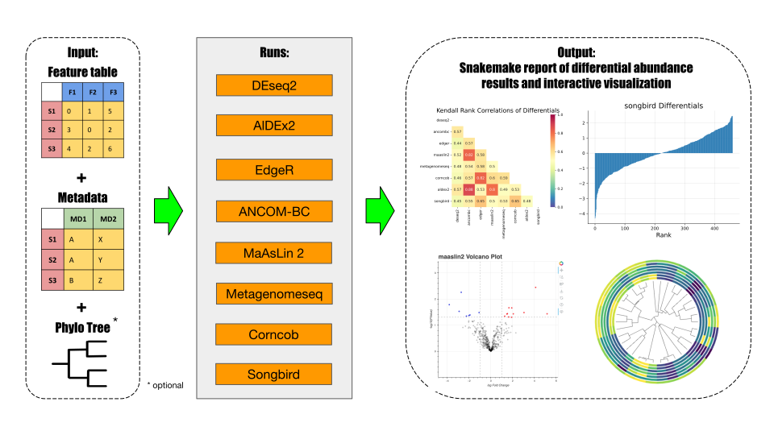

# Qadabra: **Q**uantitative **A**nalysis of **D**ifferential **Ab**undance **Ra**nks

##### (Pronounced *ka-da-bra*)

Qadabra is a Snakemake workflow for running and comparing several differential abundance (DA) methods on the same microbiome dataset.

Importantly, Qadabra focuses on both FDR corrected p-values *and* [feature ranks](https://www.nature.com/articles/s41467-019-10656-5) and generates visualizations of differential abundance results.



Please note this software is currently a work in progress. Your patience is appreciated as we continue to develop and enhance its features. Please leave an issue on GitHub should you run into any errors.

## Installation

### Option 1: Pip install from [PyPI](https://pypi.org/project/qadabra/0.3.0a1/)
```
pip install qadabra
```

Qadabra requires the following dependencies:
* snakemake
* click
* biom-format
* pandas
* numpy
* cython
* iow

Check out the [tutorial](tutorial.md) for more in-depth instructions on installation.


### Option 2: Install from source (this GitHub repository)
Prerequisites

Before you begin, ensure you have Git and the necessary build tools installed on your system.

Clone the Repository
```
git clone https://github.com/biocore/qadabra.git
```

Navigate to repo root directory where the `setup.py` file is located and then install QADABRA in editable mode
```
cd qadabra
pip install -e .
```

## Usage

### 1. Creating the workflow directory

Qadabra can be used on multiple datasets at once.
First, we want to create the workflow directory to perform differential abundance with all methods:

```
qadabra create-workflow --workflow-dest <directory_name>
```

This command will initialize the workflow, but we still need to point to our dataset(s) of interest.

### 2. Adding a dataset

We can add datasets one-by-one with the `add-dataset` command:

```
qadabra add-dataset \
    --workflow-dest <directory_name> \
    --table <directory_name>/data/table.biom \
    --metadata <directory_name>/data/metadata.tsv \
    --tree <directory_name>/data/my_tree.nwk \
    --name my_dataset \
    --factor-name case_control \
    --target-level case \
    --reference-level control \
    --confounder confounding_variable(s) <confounding_var> \
    --verbose
```

Let's walkthrough the arguments provided here, which represent the inputs to Qadabra:

* `workflow-dest`: The location of the workflow that we created earlier
* `table`: Feature table (features by samples) in [BIOM](https://biom-format.org/) format
* `metadata`: Sample metadata in TSV format
* `tree`: Phylogenetic tree in .nwk or other tree format (optional)
* `name`: Name to give this dataset
* `factor-name`: Metadata column to use for differential abundance
* `target-level`: The value in the chosen factor to use as the target
* `reference-level`: The reference level to which we want to compare our target
* `confounder`: Any confounding variable metadata columns (optional)
* `verbose`: Flag to show all preprocessing performed by Qadabra

Your dataset should now be added as a line in `my_qadabra/config/datasets.tsv`. 

You can use `qadabra add-dataset --help` for more details. 
To add another dataset, just run this command again with the new dataset information.

### 3. Running the workflow

The previous commands will create a subdirectory, `my_qadabra` in which the workflow structure is contained.
From the command line, execute the following to start the workflow:
```
snakemake --use-conda --cores <number of cores preferred> <other options>
```
Please read the [Snakemake documentation](https://snakemake.readthedocs.io/en/stable/executing/cli.html) for how to run Snakemake best on your system.

When this process is completed, you should have directories `figures`, `results`, and `log`.
Each of these directories will have a separate folder for each dataset you added.

### 4. Generating a report

After Qadabra has finished running, you can generate a Snakemake report of the workflow with the following command:

```
snakemake --report report.zip
```

This will create a zipped directory containing the report.
Unzip this file and open the `report.html` file to view the report containing results and visualizations in your browser.

## Tutorial
See the [tutorial](tutorial.md) page for a walkthrough on using Qadabra workflow with a microbiome dataset.

## FAQs
Coming soon: An [FAQs](FAQs.md) page of commonly asked question on the statistics and code pertaining to Qadabra.

## Citation
The manuscript for Qadabra is currently in progress. Please cite this GitHub page if Qadabra is used for your analysis. This project is licensed under the BSD-3 License. See the [license](LICENSE) file for details.
