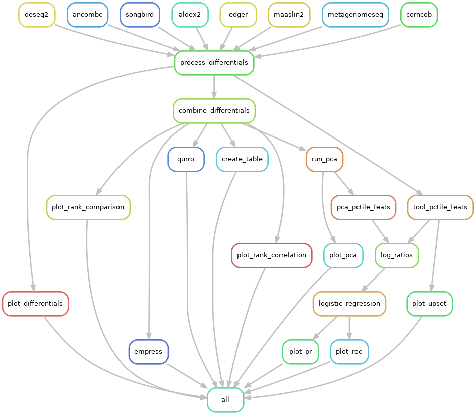

# qadabra

**Q**uantitative **A**nalysis of **D**ifferential **Ab**undance **Ra**nks

Qadabra is a Snakemake workflow for comparing the results of differential abundance tools.
Importantly, Qadabra focuses on feature *ranks* rather than FDR corrected p-values.

## Usage

Qadabra requires both [Snakemake](https://snakemake.readthedocs.io/en/stable/) and [Snakedeploy](https://snakedeploy.readthedocs.io/en/latest/) to be installed.

```
snakedeploy deploy-workflow https://github.com/gibsramen/qadabra qadabra_dir --tag v0.1.2
```

This will download the workflow to your local machine.
Enter this directory, open the `config/config.yaml` file, and replace the `table` and `metadata` entries to point to your feature table and sample metadata files.
You should also change the model covariate, target, and reference category.

* `covariate`: Name of the categorical metadata column to perform differential abundance
* `target`: Level of `covariate` on which you are interested in performing differential abundance
* `reference`: Reference category for log-fold change calculation

If you have other confounders, you can include them under the `confounders` heading.
Delete these if you are not including any additional confounders.
Note you should still leave the `counfounders` entry - just delete the entries in the list.

Qadabra can also output an [EMPress plot](https://journals.asm.org/doi/10.1128/mSystems.01216-20) of a phylogenetic tree annotated with each tool's differentials.
Change the `tree` entry to point to this file.
If you do not have a phylogenetic tree, change this entry to an empty string and EMPress will not be run.

Run `snakemake --use-conda <other options>` to start the workflow.
Please read the [Snakemake documentation](https://snakemake.readthedocs.io/en/stable/executing/cli.html) for how to run Snakemake best on your system.

When this process is completed, you should have directories `figures`, `results`, and `log`.
You can also generate a report of the workflow with the following command

```
snakemake --report report.zip
```

This will create a zipped directory containing the report.
Unzip this file and open the `report.html` file to view the report in your browser.

## Workflow Overview



Qadabra runs several differential abundance tools on the same dataset.
The features are ranked according to their association with the given metadata covariate.
The top and bottom features are then used to create log-ratios according to [Morton 2019](https://doi.org/10.1038/s41467-019-10656-5) and [Fedarko 2020](https://github.com/biocore/qurro).
These log-ratios are used as predictors in logistic regression models to predict the class given the log-ratio.

### Output

Qadabra generates many results files including many intermediate files that can be explored further.

#### Results

Each tool's output is stored in a separate subdirectory.
For the R tools, an RDS object with the tool's R data is saved.
The raw outputs are processed and concatenated into a file called `concatenated_differentials.tsv`.
A Qurro visualization of all the tool ranks is generated at `results/qurro/index.html`.
An interactive table with all the tool outputs is at `results/differentials_table.html`.

For each tool, the ranked features are used for machine learning models.
The `config.yaml` file enumerates the percentile of feats to use for log-ratios.
For example, at the 5% percentile, the top 5% of features and the bottom 5% of features associated with `covariate` are used to compute a log-ratio for each sample.
This log-ratio is used in repeated K-fold cross-validation to determine how well this log-ratio can predict class membership using logistic regression.
The `ml` subdirectory of each tool contains the features used, sample log-ratios, and compressed model objects.

#### Figures

The differential rank plots of each tool are plotted as `<tool_name>_differentials.svg`.
A heatmap of the pairwise Spearman correlation among all pairs of tools is available as well.
We also generated interactive plots to help compare the ranks of different microbes from the tools.
`figures/pca.svg` generates a PCA plot of all the microbes, showing the concordance and discordance of results as well as the contribution of the tools.
You can use the `figures/rank_comparisons.html` webpage to dynamically explore the relationship between pairs of tools.
The `upset` subdirectory contains [UpSet](https://doi.org/10.1109%2FTVCG.2014.2346248) plots comparing the features from each tool.
Finally, the `roc` and `pr` subdirectories contain ROC and PR (respectively) plots of all tools at each percentile of features.
