# Qadabra tutorial
Qadabra is a Snakemake workflow for running and comparing several differential abundance (DA) methods (tools) on the same microbiome dataset.

In this tutorial, we will run Qadabra on a small dataset to guide you through its usage. This dataset comprises of skin microbiome samples swabbed from individuals with acne and sequenced by shotgun metagenomics. A clinical trial was conducted where a topical skin cream containing a strain of _Staphylococcus capitis_ producing a potent antimicrobial peptide against _Cutibacterium acnes_ (the bacteria most involved with acne) was applied on research volunteers to see if their acne improves. Let's investigate how the individuals' skin microbiome changes by differential abundance analysis of microbes pre- and post-treatment from this study using Qadabra.

If you are interested in learning more about the skin microbiome in dermatological diseases, check out this [review paper](https://www.frontiersin.org/articles/10.3389/fimmu.2023.1151527/full). 


## 1. Installation
We reccommend installing [mamba](https://anaconda.org/conda-forge/mamba) to manage your Qadabra environment. Once mamba is installed, create and activate your Qadabra environment:
```
mamba create -n qadabra_env python=3.9
mamba activate qadabra_env
```
Install Qadabra and it's dependencies using [pip](https://pypi.org/project/pip/):
```
pip install qadabra snakemake click biom-format pandas numpy cython iow
```

## 2. Create the workflow directory
```
qadabra create-workflow --workflow-dest my_qadabra
cd my_qadabra
```
You have now created a directory called `my_qadabra` with two subdirectories inside, `config` and `workflow`.

## 3. Create the dataset directory and download tutorial files
Create a `data` directory to put your input files.
```
mkdir data
```
Navigate to the `tutorial_data` directory in the Qadabra GitHub repo:
`qadabra/qadabra/tutorial_data/`.
Download `qadabra_tutorial_table.biom` and `qadabra_tutorial_metadata.tsv` and move these files to your newly created `data` directory.

## 4. Add your dataset to the Qadabra workflow
In the same level as your `my_qadabra` directory, run the following with the `add-dataset` command:
```
qadabra add-dataset \
    --workflow-dest my_qadabra \
    --table my_qadabra/data/qadabra_tutorial_table.biom \
    --metadata my_qadabra/data/qadabra_tutorial_metadata.tsv \
    --name skin_microbiome \
    --factor-name group \
    --target-level Day_90 \
    --reference-level Baseline \
    --verbose
```
You can check that your dataset was added by navigating to `config/datasets.tsv`.

## 5. Running the workflow

From the command line, execute the following to start the workflow:
```
snakemake --use-conda --cores 4
```
(This took approximately 8 minutes to run on a MacBook Pro, 2.6 GHz Quad-Cores Intel Core i7 with 16GB of RAM).

## 6. Generating a report

After Qadabra has finished running, you can generate a Snakemake report of the workflow with the following command:

```
snakemake --report report.zip
```

This will create a zipped directory containing the report.
Unzip this file and open the `report.html` file to view the report containing results and visualizations in your browser.


## Exploring Qadabra outputs

Qadabra generates many results files and intermediate files that can be explored further.

#### Results files

The differential abundance results from Qadabra are outputted in terms of FDR corrected p-values and feature ranks. 
These results can be found in the `results/<dataset_name>/` directory. Let's walkthrough the Qadabra results files: 
* `concatenated_differentials.tsv`: TSV table containing the differentials from each method.
* `concatenated_pvalues.tsv`: TSV table containing the FDR corrected p-values from each method.
* `differentials_table.html`: HTML table displaying concatenated_differentials.tsv.
* `pvalues_table.html`: HTML table displaying concatenated_pvalues.tsv.
* `qadabra_all_result.tsv`: TSV table containing differentials, FDR corrected p-values, and the number of methods passing significance threshold of 0.05 for each feature. (This table is used as the metadata for EMPress if a phylogenetic tree input is present.)

Each method's individual outputs are stored in a separate subdirectory under the `results/<dataset_name>/methods/<method>` subdirectories. 
* `differentials.tsv`: This file contains the differential abundance results as outputted by each individiual method.
* `differentials.processed.tsv`: This file extracts just the differentials column from differentials.tsv.
* `pvalues.processed.tsv`: This file extracts just the p-value column from differentials.tsv.
* `results.rds`: For the R methods (all except Songbird), an RDS object with the method's R data is saved.

A [Qurro](https://github.com/biocore/qurro) visualization of all the method ranks is generated at `results/<dataset_name>/qurro/index.html`.

For each method, the ranked features are used for machine learning models.
The `results/<dataset_name>/ml` subdirectory of each method contains the features used, sample log-ratios, and compressed model objects.

Results from the PCA analysis can be found under `results/<dataset_name>/pca`.

#### Figures

The generated Snakemake report contains the following folder structure:
* `Differentials`
    - `Comparison`
        - `differentials_table.html`: HTML table displaying concatenated_differentials.tsv.
        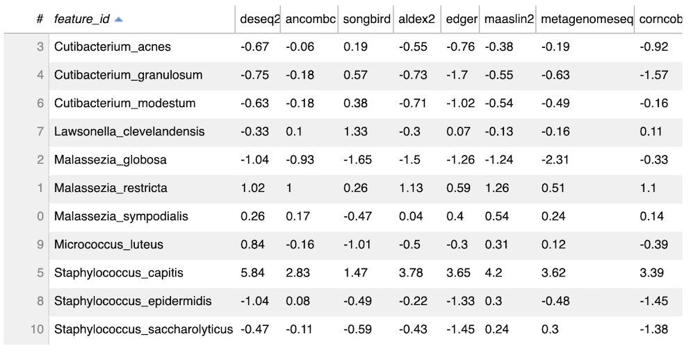
        - `kendall_diff_heatmap.svg`: Heatmap showing degree of concordance of differentials between methods.
        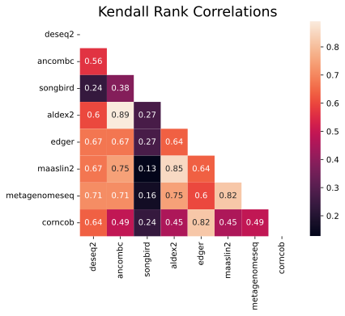
        - `differential_pw_comparisons.html`: Interactive plot displaying pairwise correlations of differentials between any two DA methods.
        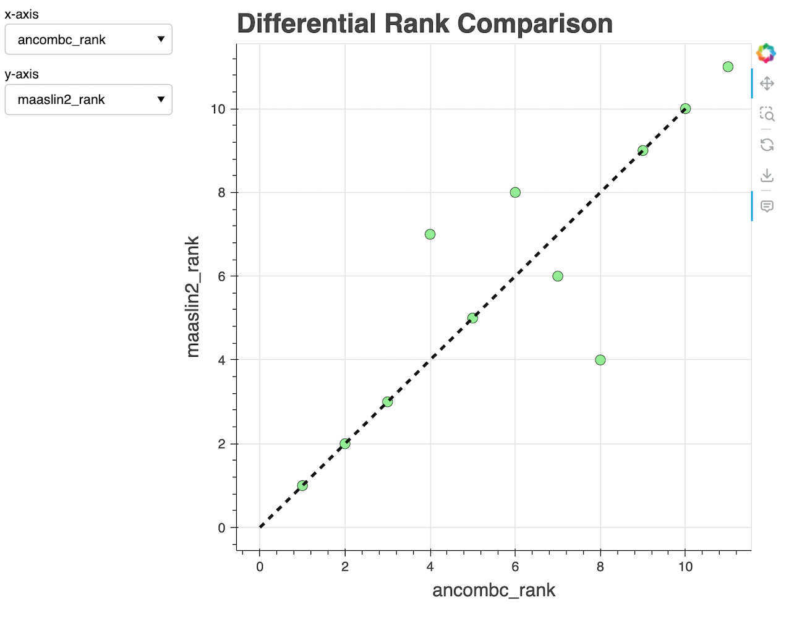
        - `pca.svg`: PCA plot showing method-specific effects on the ranking of features.
        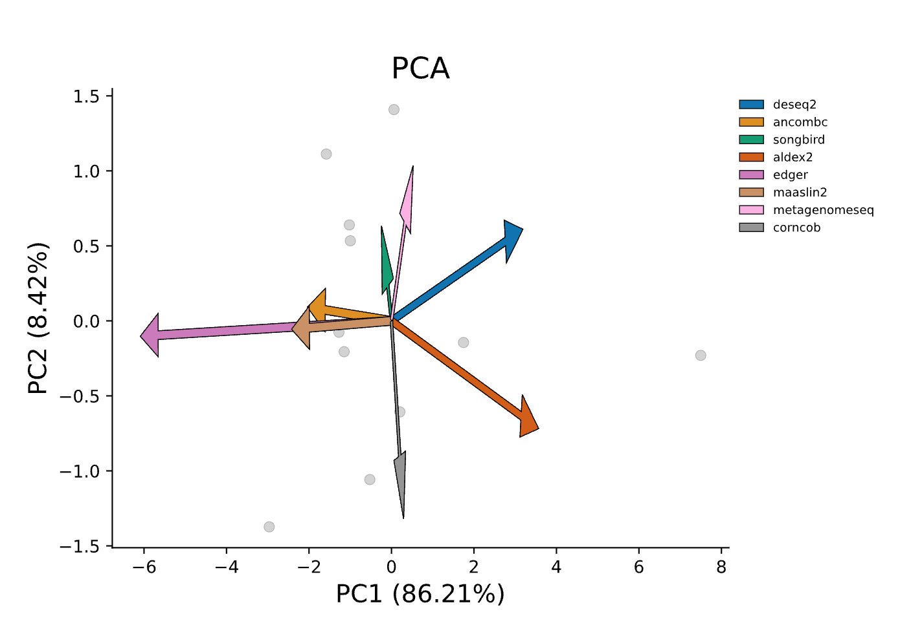
        - `qurro/index.html`: Interactively explore feature ranks with Qurro.
        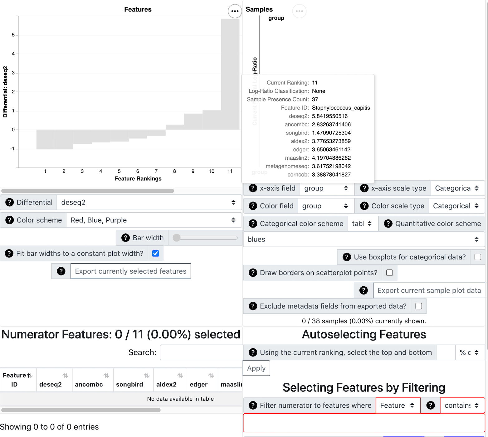

    - `UpSet plots`: [UpSet](https://doi.org/10.1109%2FTVCG.2014.2346248) plots comparing the features from each method for top and bottom 20%, 15%, 10%, and 5% of features.
            <div style="display: flex;">
    
    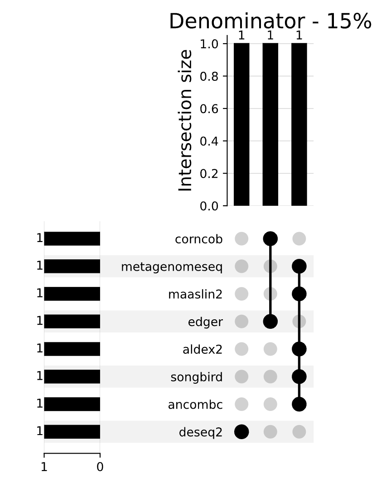
    </div>

    - `Rank plots`: Differential rank plots of each method. Features with a positive log ratio are more associated with `target-level`. Featues with a negative log ratio are more associated with `reference-level`.
            <div style="display: flex;">
        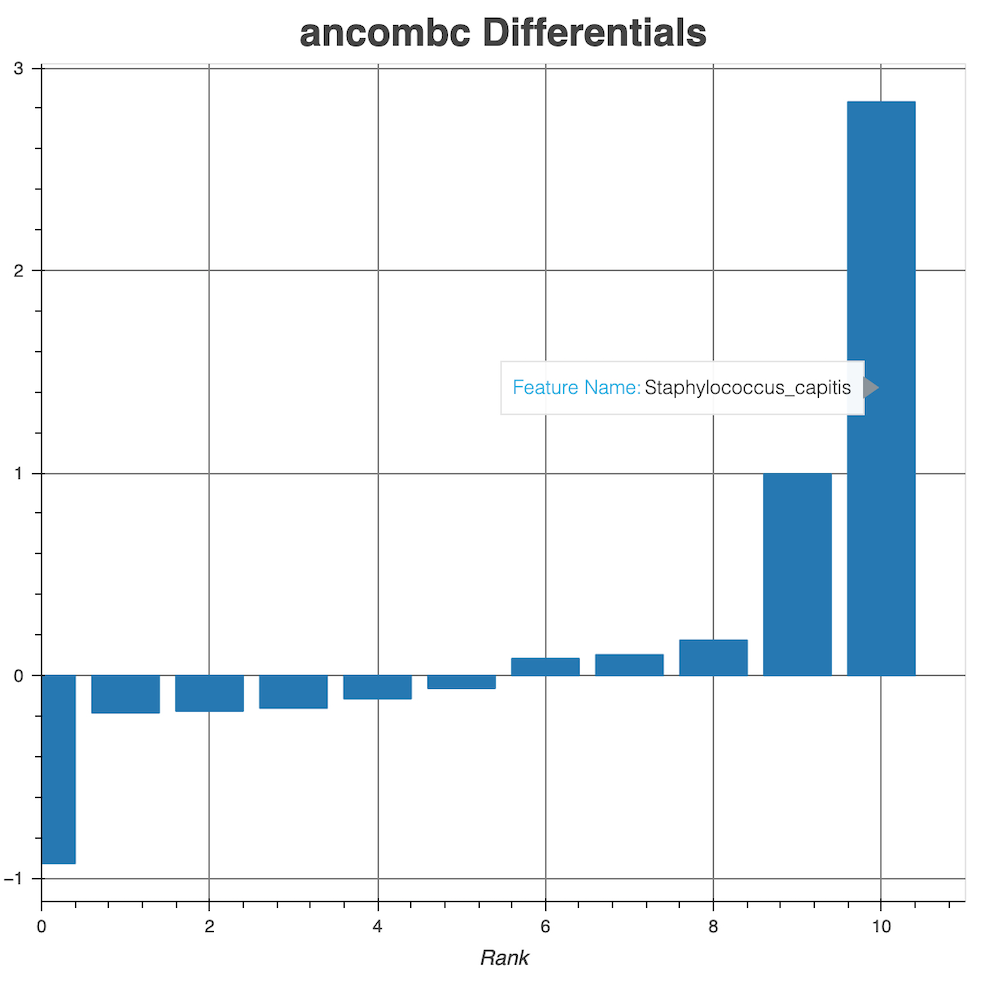
        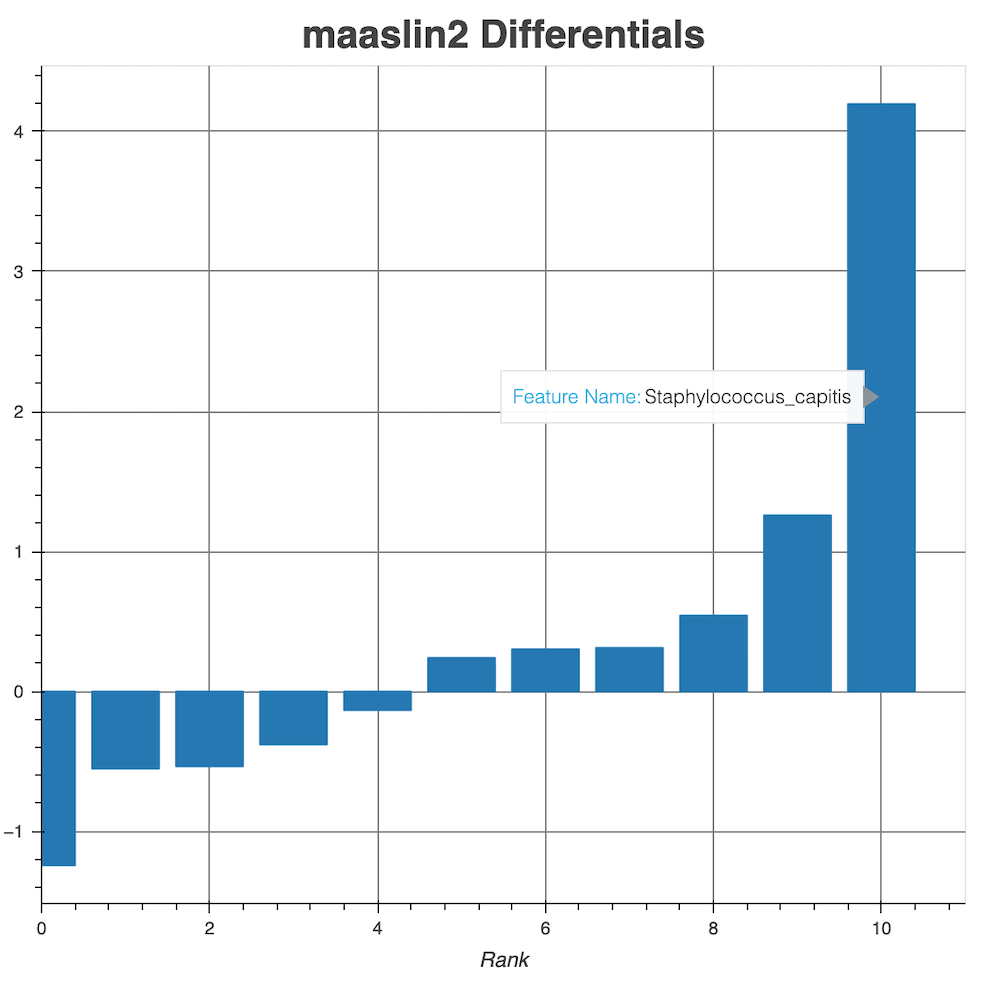
        </div>

* `P-values`
    - `Comparison`
        -  `pvalues_table.html`: HTML table displaying concatenated_pvalues.tsv.
        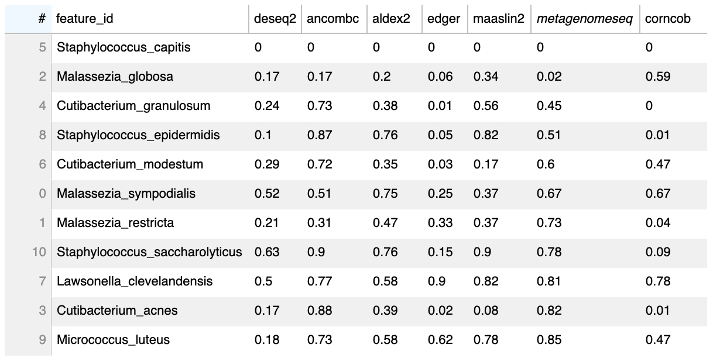

        - `kendall_pvalue_heatmap.svg`: Heatmap showing degree of concordance of p-values between methods.
        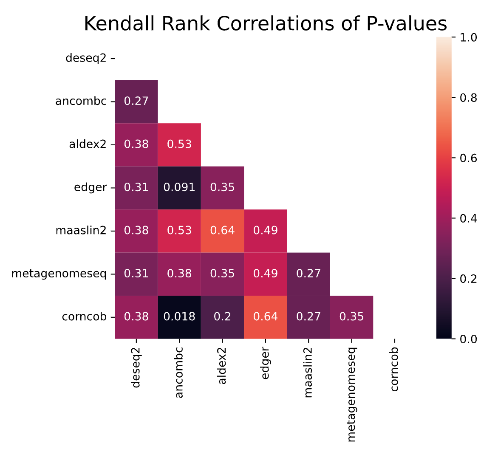

        - `pvalue_pw_comparisons.html`: Interactive plot displaying pairwise correlations of p-values between any two p-value producing methods.
        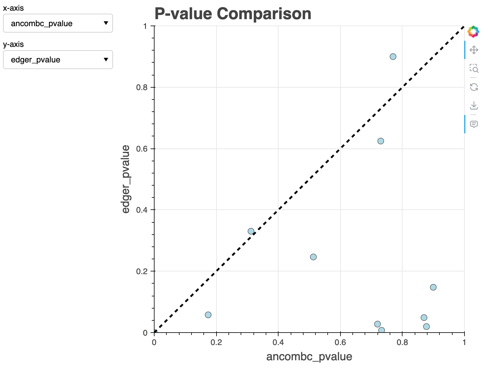

    - `Volcano plots`: [Volcano plots](https://en.wikipedia.org/wiki/Volcano_plot_(statistics)) for each p-value producing method.
            <div style="display: flex;">
        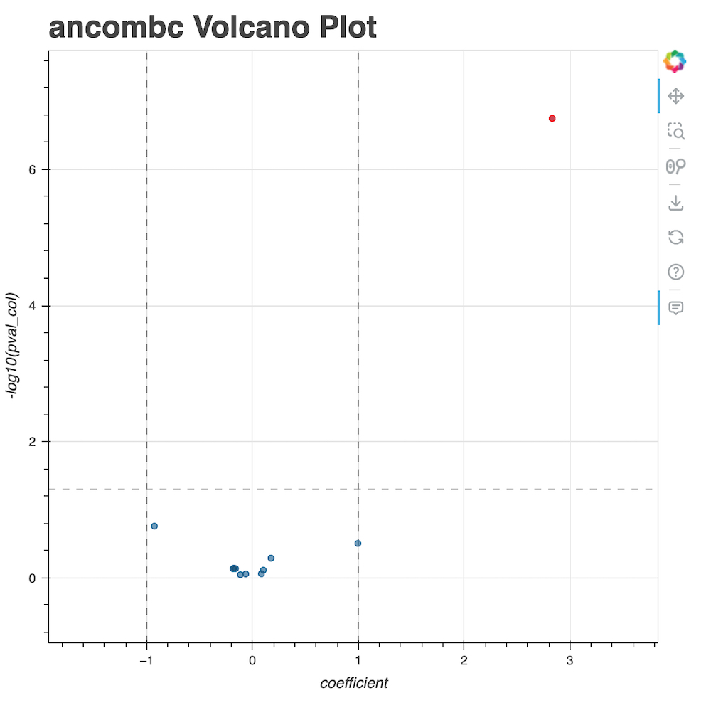
        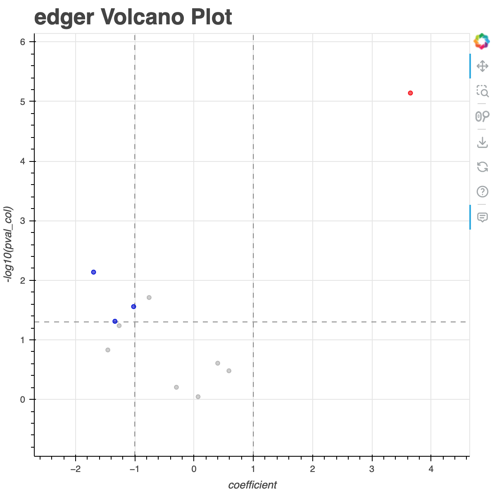
        </div>  
    - `EMPress plot`: An EMPress.html file to interactively explore differential abundance results with respect to phylogenetic relationships (if a tree was provided).


## Interpretations
In this example dataset, all differential abundance methods agree by both p-values and differentials that _Staphylococcus capitis_ is differentially abundant in the 90 Days Post-Treatment samples compared to the Baseline (not treated with _S. capitis_) as expected based on the design of the clinical trial. Whether the application of the _S. capitis_ strain successfully reduced _Cutibacterium acnes_ populations remains to be debated based on the differential abundance results. However, those tools that do report some species that are statistically decreased at Post-Treatment are mostly _Cutibacterium_ species.


## Additional workflow options

### Workflow subsetting

In some cases you may not want to run the full workflow and may only be interested in just running certain methods.

If you navigate into your `my_qadabra` directory, you should see two folders: `config` and `workflow`. If you open the `config/config.yaml` file, you can see a number of options with which to run Qadabra. You can modify these as you like to eschew certain parts of the workflow.
For example, if you want to only run DESeq2, ANCOM-BC, and Songbird, you can delete the other entries in the `methods` heading.

### Incorporating confounders

You can also specify additional confounders to incorporate into your DA model.
When adding a dataset, use `--confounder <column name>` to add a confounder into your model.
You can add multiple confounders by adding more `--confounder <column name>` arguments to `add-dataset`.

### Phylogenetic visualization

Qadabra allows users to visualize the differentials and p-values on an interactive phylogenetic tree using [EMPress](https://journals.asm.org/doi/10.1128/mSystems.01216-20).
With EMPress, you can annotate the tree with the differentials as barplots.
This can be useful for determining phylogenetic signal in differential abundance. See the [EMPress GitHub](https://github.com/biocore/empress) page for more information and tutorial.

## Issues and contributing

If you encounter any problems with Qadabra, please open a New Issue in the GitHub Issues table. Contributions are welcome and greatly appreciated. If you have any improvements or bug fixes, please follow these steps:

1. Fork the repository.
2. Clone the repository to your local computer: `git clone <link-to-forked-repo>`
3. Create a new branch: `git checkout -b feature/your-feature`
4. Make your changes and commit them: `git commit -m 'Add your feature'`
5. Push the branch to your forked repository: `git push origin feature/your-feature`
6. Open a pull request detailing your changes.

Please ensure that your code adheres to the existing code style and that you include appropriate tests.